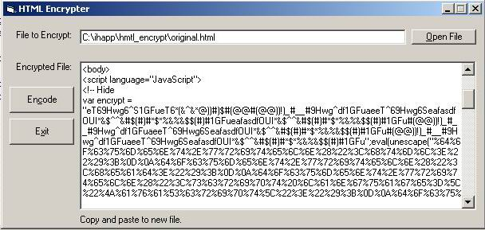



## html encode

### Description

Encodes HTML

Takes HTML and encodes it to HEX.

This is a simple app. You may use as you see fit.

But Please Vote for me! Thanks ;-)
 
### More Info
 
Any valid HTML page

This is a simple app. You may use as you see fit.

But Please Vote for me! Thanks ;-)

Encode HTML source

             |
---                |---
**Submitted On**   |2003-04-25 16:30:20
**By**             |[Kevin Xiong](https://github.com/Planet-Source-Code/PSCIndex/blob/master/ByAuthor/kevin-xiong.md)
**Level**          |Beginner
**User Rating**    |5.0 (10 globes from 2 users)
**Compatibility**  |VB 6\.0
**Category**       |[Complete Applications](https://github.com/Planet-Source-Code/PSCIndex/blob/master/ByCategory/complete-applications__1-27.md)
**World**          |[Visual Basic](https://github.com/Planet-Source-Code/PSCIndex/blob/master/ByWorld/visual-basic.md)
**Archive File**   |[html\_encod1579394252003\.zip](https://github.com/Planet-Source-Code/kevin-xiong-html-encode__1-45034/archive/master.zip)

